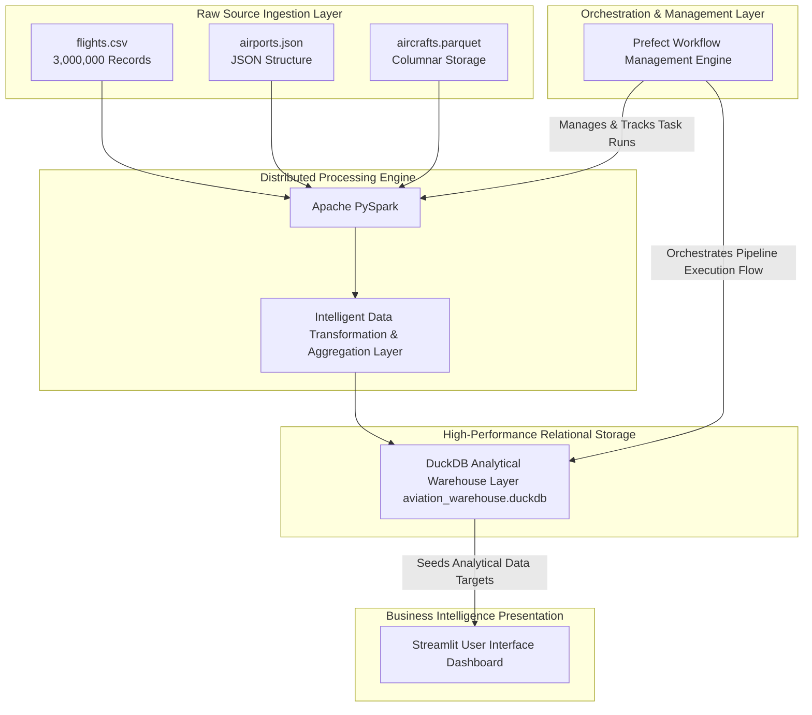

# Global Aviation Analytics Platform — End-to-End Big Data ETL Pipeline

> **Big Data & Analytics Course Assignment**
> **Institution:** Debre Berhan University
> **Tech Stack:** Apache PySpark • DuckDB • Prefect v3 • Streamlit • Plotly

---

## 📋 Business Problem & Overview

Modern aviation infrastructure demands rapid data integration from completely diverse operational systems. This project designs and implements an advanced, scalable data platform that pulls from **three heterogeneous data sources** to build a reliable unified analytics environment.

By handling high-volume operational metrics, this architecture answers key enterprise business intelligence questions:
- Which airline carriers drive the highest gross yield and ticket revenue?
- How do system delays distribute across operations, and what is the overall system mean delay?
- Which regional hub nodes experience the highest traffic volume and busiest terminal sectors?
- How do delay pattern footprints break down by disruption categories (`On-Time`, `Minor Delay`, `Moderate Delay`, `Severe Delay`)?

---

## 🏗️ Architecture & Data Flow



---

## 📁 Repository Structure

```bash
BIGDATA-ETL-PROJECT/
├── Dashboard/
│   └── dashboard.py                  # Live Streamlit application UI
├── data/
│   ├── processed/                    # High-performance target outputs
│   │   ├── staging/                  # Exported BI analytical sheets
│   │   │   ├── dim_airline.csv
│   │   │   ├── dim_airport.csv
│   │   │   ├── dim_route.csv
│   │   │   └── fact_flights.csv      # Processed dataset matrix (3M records)
│   │   └── aviation_warehouse.duckdb # Complete DuckDB Warehouse File
│   └── raw/                          # Raw diverse input storage
│       ├── aircrafts.parquet
│       ├── airports.json
│       └── flights.csv
├── orchestration/
│   └── manage_pipeline.py            # Prefect workflow execution & task logic
├── scripts/                          # Modular execution layer files
│   ├── extract.py                    # Multi-source data extraction rules
│   ├── transform.py                  # Data cleansing & star schema logic
│   └── load.py                       # DuckDB relational target storage logic
├── generate_missing_sources.py       # Initial mock data seeder file
├── requirements.txt                  # Consolidated system dependencies
├── run_pipeline.py                   # Master platform execution engine script
└── README.md                         # Detailed project documentation
```

---

## 🚀 Installation & Execution Guide

### 1. Configure the Virtual Environment & Dependencies

Initialize your environment and install all framework dependencies (including PySpark, DuckDB, Prefect, and Streamlit):

```powershell
# Create environment
python -m venv venv

# Activate virtual environment
.\venv\Scripts\activate

# Install requirements
pip install -r requirements.txt
```

### 2. Seed Raw Datasets

Generate the multi-format local raw mock source data files (CSV, JSON, and Parquet) if missing:

```powershell
python generate_missing_sources.py
```

### 3. Execute with Production-Grade Orchestration (Bonus Objective)

To launch the pipeline end-to-end under a managed workflow orchestration layer with retries, run the dedicated master control flow:

```powershell
python orchestration/manage_pipeline.py
```

> **Note:** This script automatically handles internal environment adjustments to guarantee smooth logging rendering across Windows terminal boundaries.

### 4. Launch the Interactive Analytical Dashboard

Once the orchestration run logs output a successful pipeline completion status, initialize the BI suite to view the insights live:

```powershell
streamlit run Dashboard/dashboard.py
```

---

## 📊 Heterogeneous Data Ingestion Summary

| Raw Dataset Source | Storage Format | Scale Managed | Domain Role |
|---|---|---|---|
| `flights.csv` | Comma-Separated Values | **3,000,000 Rows** | Main operational records & flight metrics |
| `airports.json` | JavaScript Object Notation | Multi-nested Objects | Regional master metadata mapping |
| `aircrafts.parquet` | Columnar Parquet File | Compact Records | Structural fleet models & engine layouts |

---

## 🔧 Core Data Engineering Operations

- **Distributed Data Transformation:** Utilizes PySpark DataFrame APIs for fast, non-blocking operations on dense datasets.
- **Star Schema Dimensional Design:** Normalizes chaotic multi-source properties into clean star-schema relational entities: `fact_flights`, `dim_airline`, `dim_route`, and `dim_airport`.
- **Intelligent Analytical Fields:** Implements dynamic parsing to build custom categories:
  - **Delay Footprint Categorization:** Grouped into `On-Time`, `Minor Delay`, `Moderate Delay`, and `Severe Delay` classes to study system bottleneck distributions.
  - **Temporal & Spatial Analytics:** Extractions of busiest routes, hub nodes, and performance lead metrics.
- **Relational Analytical Loading:** Atomically seeds clean dimension matrices and the core flight fact layer straight into a fast local **DuckDB warehouse engine**.

---

## 👥 Project Team & Primary Contributions

| Group Member | Student ID | Primary Architectural Role & Functional Contributions |
|---|---|---|
| **Mekdes Wonde** | DBU1601854 | Analytical Data Extraction Routines (`scripts/extract.py`), Star Schema Relational Blueprinting, and Input File Validations. |
| **Haymanot Mekonen** | DBU1601247 | UI/UX Analytical Visual Suite Architecture (`Dashboard/dashboard.py`), Chart Controls, and KPI Widget Logic. |
| **Mestawot Mihrete** | DBU1601337 | Platform Deployment Coordinator, Repository Structure Standardization, System Configurations, and Master Run Script (`run_pipeline.py`). |
| **Rediet Abay** | DBU1601572 | Overall System Architecture Design, Target Database Loading Engine (`scripts/load.py`), and DuckDB Integration. |
| **Hanna Getachew** | DBU1601241 | Distributed Compute Engineering, Core PySpark Transformations Layer (`scripts/transform.py`), and Multi-Source Data Alignment. |
| **Betelehem Fasil** | DBU1601455 | Business Intelligence Aggregations, Data Format Ingestion Pipelines, and Multi-Source Key Association Testing. |

---

## 🎯 Assignment Requirements Checklist

- [x] **Scalable Big Data Pipeline Architecture** — Fully mapped, documented, and separated into ingestion, computing, and analytical layers.
- [x] **Multi-Source Ingestion (3+ Formats)** — Reads seamlessly from CSV, JSON, and Columnar Parquet.
- [x] **Distributed Engine Computing** — Leverages Apache PySpark to easily scale processing over millions of rows.
- [x] **Analytical Storage Engine** — Saves outputs directly to a local, high-performance DuckDB analytical instance file.
- [x] **Workflow Management Orchestration (BONUS)** — Integrated with **Prefect v3** to handle task execution loops and automation.
- [x] **Interactive Presentation Dashboard** — Deployed a **Streamlit** user interface featuring Plotly visual elements.

---

## 📸 Dashboard Preview

### Core Infrastructure Analytics Summary Page

*Tracks core infrastructure volume KPIs, global ticket revenue figures ($75B generated across 3M flights), operational delay breakdowns, and gross carrier yield fields.*

### Operations, Terminals, and High-Traffic Sectors Matrix Page

*Displays spatial node performance maps, including the busiest regional terminals (ATL, DFW, ORD) and active flight sectors (SFO → LAX) extracted by the engine.*

---

*Developed for the University of Debre Brihan  Big Data  Assignment — May 2026*
